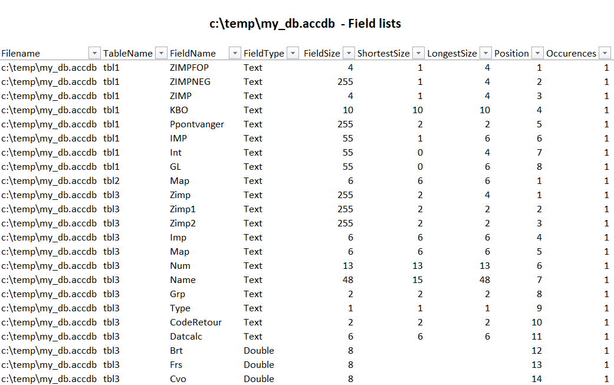

# VBS script for getting the list of fields in a MS Access database

> This script will scan a MS Access database, loop through all tables, get the list of fields and properties and will generate a .csv file

## Table of Contents

- [Install](#install)
- [Usage](#usage)
- [License](#license)
- [Author](#author)

## Install

Get a raw copy of `access_get_fields_list.vbs` and save it onto your disk.

If you want, get also a copy of `access_get_fields_list.cmd` and save it in the same folder.

## Usage

### With the .vbs only

1. Place the `access_get_fields_list.vbs` script in the folder where you've your database
2. Start a DOS prompt
3. Go to the folder where you've your database (and also the script)
4. Run `cscript access_get_fields_list.vbs "my_db.accdb"`

### With the access_get_fields_list.cmd

1. Save the .vbs and the .cmd files in the same folder (f.i. `c:\data\`); the location isn't important.
2. Edit the `access_get_fields_list.cmd` file in Notepad
3. Modify the path to the database (in the example, it's `C:\temp\my_db.accdb`, modify and type the path to your database).
4. Save the file
5. Just double-clic on the file to execute it.

## Example

[Open a sample file](sample.xlsx)

Note : the generated file is a .csv file, stored in your `%TEMP%` folder, the script will open it with MS Excel and add a few features like a title, autofilters, ... so, if you save the file, you'll obtain a .xlsx file.

## Description of returned info

- Filename : The MS Access filename (absolute)
- TableName : The name of the table
- FieldName : The name of the field found in that table
- FieldType : The data type (integer, string, date, ...)
- FieldSize : The maximum size defined in the table (f.i. 255 means that this field can contains up to 255 characters)
- ShortestSize : When the table contains records, the ShortestSize info is "what is the smaller information stored in that field ?" (example : if the field is a firstname, size 255 but the shortest firstname is `Paul`, then `ShortestSize` will be set to 4)
- LongestSize : When the table contains records, the `LongestSize` info is "what is the biggest information stored in that field ?" (example : if the field is a firstname, size 255 but the longest firstname is `Christophe`, then `LongestSize` will be set to 10)
- Position : The position of that field in the structure of the table (is the first defined field, the second, ...)
- Occurences : How many time, that specific `FieldName` is found in the entire database. If you've a lot of tables, perhaps the field called `CustomerID` is used in the `Customers` table and in the `Orders` table too so `Occurences` will be set to 2 in this case.

## Contribute

PRs accepted.

## License

[MIT](LICENSE)

## Author

Christophe Avonture
